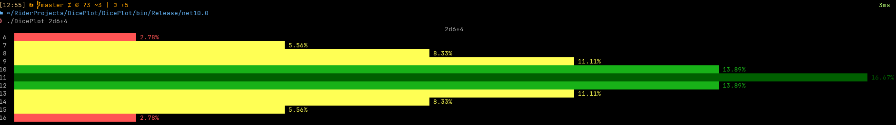
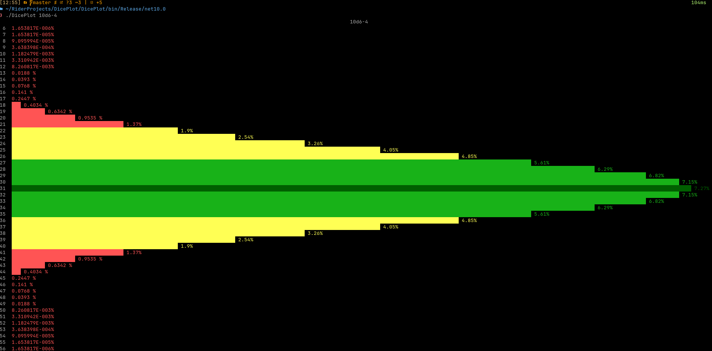

# DicePlot CLI

A simple CLI tool that diplays the probability distribution of dice rolls using Spectre.Console.

## Usage
```bash
# Build an run from source
dotnet run *roll*

# Run a compliled executable
./DicePlot *roll*
```

where `roll` matches xdx+x

The program outputs a color-coded probability distribution chart.

## Examples



